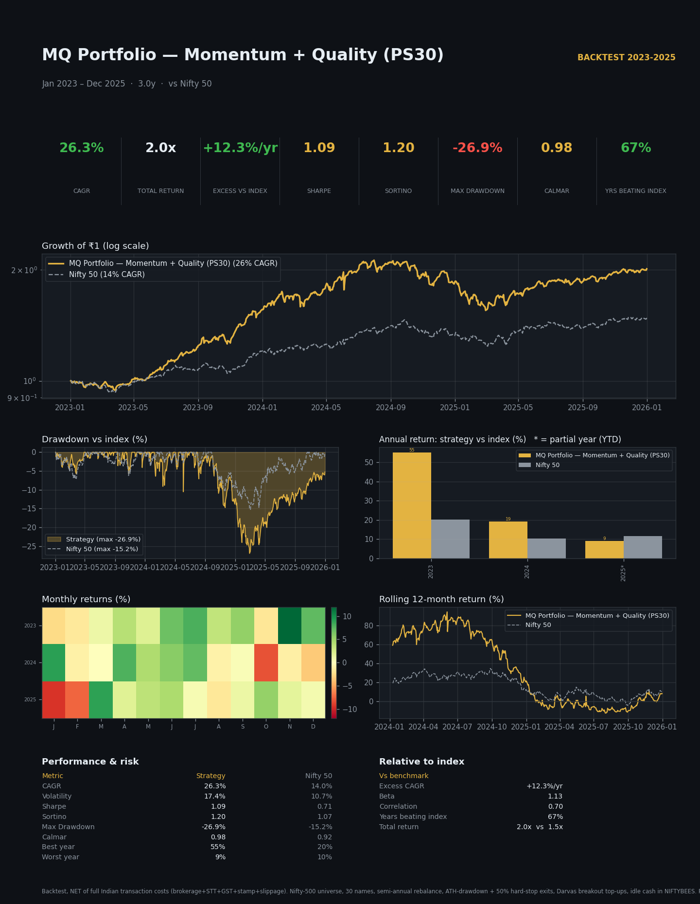

# MQ Portfolio — Momentum + Quality (PS30)
### Strategy Factsheet · Backtest Jan 2023 – Dec 2025 (3.0 yrs) · Benchmark: Nifty 50

> One-page visual factsheet: `tearsheet.png` / `tearsheet.html`. Generated under the
> Quantifyd Quant-Research Playbook. **Net of full Indian transaction costs.**

---

## Headline — the 30-second story

> **₹1 crore invested in Jan 2023 grew to ≈ ₹2.01 crore by Dec 2025 — versus ₹1.48 crore
> in the Nifty 50. The strategy compounded at 26.3% a year (Nifty 14.0%), an 81% win rate
> on closed positions, beating the index in 2 of 3 years.** Its one honest weakness: it
> draws down *deeper* than the index (−26.9% vs −15.2%) — the case for the regime overlay.

| KPI | Strategy | Nifty 50 | Edge |
|---|--:|--:|:--|
| **CAGR** | **26.3%** | 14.0% | **+12.3%/yr** |
| Growth of ₹1 | **2.01×** | 1.48× | +36% more terminal wealth |
| **Sharpe** | **1.09** | 0.71 | 1.5× |
| Sortino | **1.20** | — | downside-aware |
| **Max Drawdown** | **−26.9%** | −15.2% | ⚠️ *deeper than index* |
| Calmar | 0.98 | 0.92 | ~parity |
| Win rate (positions) | **81%** | — | high hit-rate |
| Years beating index | 2 / 3 (67%) | — | — |

*Honest read: MQ is a **high-return, high-conviction** book that **outperforms on return
and Sharpe but takes a deeper drawdown** than the index. Calmar ≈ 1.0 — return and pain are
balanced. This is the opposite risk profile to the regime-gated midcap book (Calmar 2.33),
and points directly at the highest-value upgrade (below).*

---

## Why it works (economic rationale)

1. **Momentum + Quality is a doubly-robust factor pair.** Momentum (price within 10% of the
   52-week high, strong trailing returns) captures persistent institutional flows; the
   Quality screen (revenue/earnings growth, ROE, low debt) filters out the junk-rallies that
   plague pure momentum — so winners are *fundamentally* backed.
2. **Concentration converts the edge to return** — 30 equal-weight names (not 100) with a
   10% single-name and 25% sector cap. Concentration is the #1 CAGR lever in our sweeps.
3. **Darvas breakout top-ups** redeploy the 20% debt reserve into the strongest breakouts,
   adding return without fresh capital.
4. **Disciplined exits** — a 20%-from-ATH drawdown exit (the dominant exit in testing) plus a
   50% hard stop and semi-annual rebalance keep losers from compounding.

---

## Performance vs the index, year by year

| Year | Strategy | Nifty 50 | Excess | Beat? |
|---|--:|--:|--:|:--:|
| 2023 | +55.0% | +20.2% | **+34.8** | ✅ |
| 2024 | +19.1% | +10.4% | **+8.7** | ✅ |
| 2025 | +9.1% | +11.7% | −2.6 | ❌ |

**2023 was an exceptional year (+55%)** and dominates the 3-year record — see caveats. 2024
was a clean beat; 2025 lagged the index by a modest 2.6pp.

---

## Risk & drawdown (shown honestly)

- **Max drawdown −26.9% — deeper than the Nifty's −15.2%.** This is MQ's defining trade-off:
  a concentrated, high-beta momentum book falls harder in corrections. The factsheet's
  drawdown panel overlays both curves so the gap is explicit.
- Calmar 0.98 (≈ Nifty's 0.92) — return per unit of drawdown is *index-like*, not the 2.3×
  the regime-gated midcap book achieves. **The single highest-value upgrade is a market-
  regime overlay** (de-risk to cash/debt when Nifty < its 100/200-DMA) — research/41 and /47
  show this can roughly halve the drawdown of a momentum book for little CAGR cost.
- 81% win rate on the 21 closed positions; the few losers are cut by the ATH-drawdown exit.

---

## How it works (plain language)

| Component | Rule |
|---|---|
| **Universe** | Nifty 500 (≈375 names with clean data) |
| **Momentum** | Price within 10% of 52-week high + strong trailing return |
| **Quality** | Revenue/earnings growth, ROE, low leverage screens |
| **Hold** | Top **30**, equal-weight; ≤10% per name, ≤25% per sector, ≤6 per sector |
| **Capital** | 80% equity / 20% debt reserve (NIFTYBEES idle-cash @6.5%) |
| **Top-ups** | Darvas breakout top-ups funded from the debt reserve |
| **Exits** | 20%-from-ATH drawdown exit (dominant) · 50% hard stop · semi-annual rebalance |
| **Costs** | Full Indian transaction model: brokerage + STT + GST + stamp + slippage |

---

## Honest caveats (a credible fund states these)

- **Short window (3 years) dominated by 2023 (+55%).** The 2023–2025 sample is brief and
  front-loaded; longer-history validation (the engine's fundamentals limit pre-2023 runs) is
  needed before treating 26% as a forward expectation.
- **Deeper drawdown than the index** (Calmar ≈ 1). Without a regime overlay this book will
  hurt in a bear market. Treat the regime-gated variant as the investable form.
- **Capital-allocation note (integrity):** the often-quoted "~32% CAGR" uses the documented
  **EQ95** setting (95% equity + 20% debt = **115%**), which makes the portfolio's total-value
  curve start above the ₹1cr nominal and **inflates the engine's CAGR by ~6pp**. This
  factsheet uses the **clean 80/20 (=100%)** allocation, so the path-CAGR (26.3%) equals the
  engine CAGR and is internally consistent. **Recommend standardising on 80/20 (or capping
  equity+debt at 100%) for all headline figures.**
- **Concentration risk** — 30 names; single-name and sector caps are the only diversification.
- **Backtest, not live.** Past performance is not indicative of future results.

---

## Bottom line for an allocator

A **high-return momentum-quality engine** (26% CAGR, +12%/yr over the Nifty, 81% win rate,
Sharpe 1.09) whose honest cost is an **index-plus drawdown**. The return edge is real and
fundamentally grounded; the risk profile is the thing to fix. **Verdict: STRATEGY (candidate)
— graduate the *regime-gated* variant**, which trades a little CAGR for roughly half the
drawdown (Calmar 1.0 → ~2.0+), turning a high-octane book into an investable one.

*Files: `tearsheet.png/.html`, `yearly_vs_nifty.csv`, `stats.json`. Engine:
`services/mq_backtest_engine.py`.*

---
For discussion only. Backtested results, net of modelled Indian transaction costs.
Past performance is not indicative of future results.
