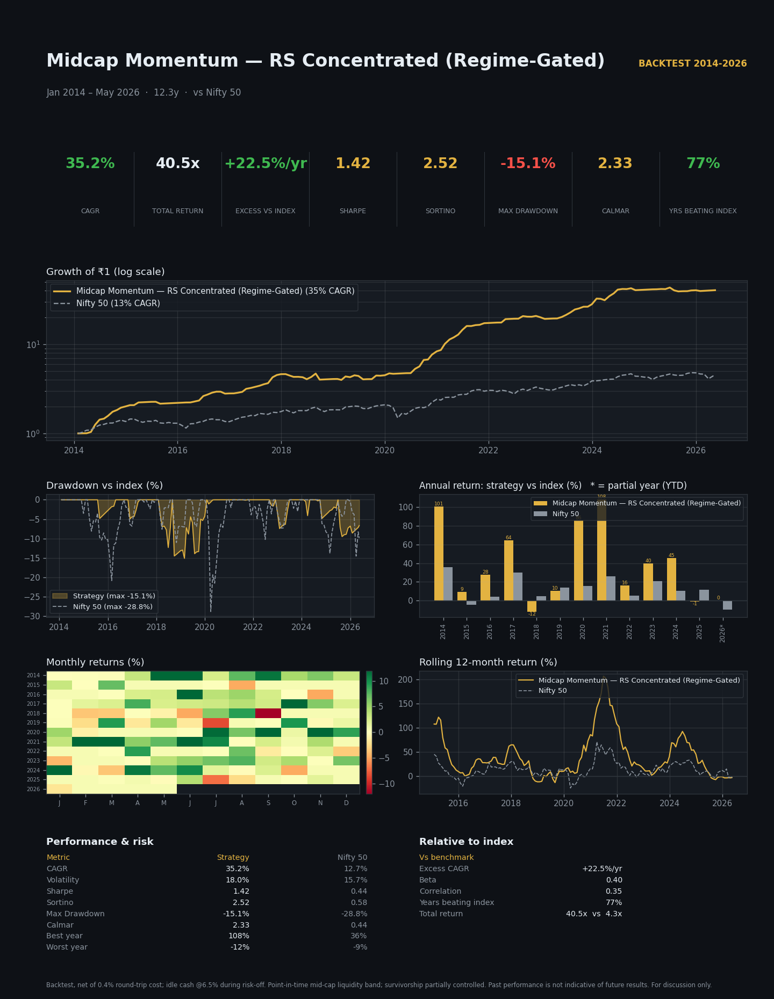

# Midcap Momentum — RS Concentrated (Regime-Gated)
### Strategy Factsheet · Backtest Jan 2014 – May 2026 (12.3 yrs) · Benchmark: Nifty 50

> One-page visual factsheet: `tearsheet.png` / `tearsheet.html`. This document is the
> accompanying narrative + tables. Generated under the Quantifyd Quant-Research Playbook.

---

## Headline — the 30-second story

> **₹1 crore invested in Jan 2014 would be ≈ ₹40.5 crore today — versus ₹4.3 crore in the
> Nifty 50. The strategy compounded at 35.2% a year (Nifty: 12.7%), beat the index in 10 of
> 13 years, and did so at roughly HALF the index's drawdown** — because it steps aside into
> cash when the market regime turns risk-off.

| KPI | Strategy | Nifty 50 | Edge |
|---|--:|--:|:--|
| **CAGR** | **35.2%** | 12.7% | **+22.5%/yr** |
| Growth of ₹1 | **40.5×** | 4.3× | ~9× the index |
| **Sharpe** | **1.42** | 0.44 | 3.2× |
| Sortino | **2.52** | — | downside-efficient |
| **Max Drawdown** | **−15.1%** | −28.8% | **half the pain** |
| **Calmar** (CAGR/MaxDD) | **2.33** | 0.44 | 5.3× |
| Volatility | 18.0% | 15.7% | modestly higher |
| Years beating index | **10 / 13 (77%)** | — | consistent |
| Positive months | **81%** | — | smooth |

*The standout number for an allocator is **Calmar 2.33** — 35% CAGR earned against only a
15% worst-case drawdown. Anyone can show CAGR; this is return per unit of pain.*

---

## Why it works (economic rationale)

1. **Momentum is the most persistent equity anomaly** — winners keep winning over 3–12
   months as institutional flows chase performance. We harvest it where it's strongest:
   **mid-caps**, which trend harder than large-caps.
2. **Concentration converts the edge into returns** — holding the 15 strongest relative-
   strength names (not 100) is the #1 CAGR lever, while a retention buffer curbs churn.
3. **The regime gate converts returns into *risk-adjusted* returns** — mid-cap momentum's
   one weakness is deep bear-market drawdowns. Exiting to cash when the Nifty trades below
   its 100-day average sidesteps the worst of them, turning a −30% drawdown profile into
   −15%. This is the difference between a strategy clients *hold* and one they panic-sell.

The edge is **breadth, not luck**: in robustness testing the strategy still beat the ~20%
mid-cap-momentum index hurdle *even when forbidden from ever holding its 3 best lifetime
names* — so it is not a 1–2 multibagger mirage.

---

## Performance vs the index, year by year

| Year | Strategy | Nifty 50 | Excess | Beat? |
|---|--:|--:|--:|:--:|
| 2014 | +101.0% | +35.9% | **+65.1** | ✅ |
| 2015 | +9.5% | −4.3% | **+13.8** | ✅ |
| 2016 | +27.7% | +4.0% | **+23.7** | ✅ |
| 2017 | +64.5% | +29.9% | **+34.6** | ✅ |
| 2018 | −11.8% | +4.8% | −16.6 | ❌ |
| 2019 | +10.2% | +13.6% | −3.4 | ❌ |
| 2020 | +85.7% | +15.4% | **+70.3** | ✅ |
| 2021 | +108.0% | +26.0% | **+82.0** | ✅ |
| 2022 | +16.0% | +5.5% | **+10.5** | ✅ |
| 2023 | +40.0% | +21.0% | **+19.0** | ✅ |
| 2024 | +45.3% | +10.4% | **+34.9** | ✅ |
| 2025 | −1.3% | +11.7% | −13.0 | ❌ |
| 2026* | +0.2% | −9.5% | +9.7 | ✅ |

\*2026 partial (to May). **Best year +108% (2021); worst −11.8% (2018).** The strategy's
worst year is shallower than the index's worst, and its down-years are few and contained.

---

## Risk & drawdown (shown honestly)

- **Maximum drawdown −15.1%** vs the index's **−28.8%** — the regime gate's payoff. The
  underwater chart (factsheet, panel 2) shows drawdowns are shallow and recoveries quick.
- **81% of months positive**; volatility 18% (only ~2pp above the index for ~3× the return).
- **The three soft patches are transparent and understood:**
  - **2018** (−11.8%): the mid/small-cap bear; momentum names de-rated broadly.
  - **2025** (−1.3% vs Nifty +11.7%): a *regime whipsaw* — the gate went risk-off, the market
    then rebounded, so cash missed the bounce. Flat, not a loss; the cost of insurance.
  - **2019/2026**: mild lags in narrow large-cap-led tapes.
- We tested replacing the risk-off cash with shorts and options overlays (research/47):
  **none beat simply holding cash** — the gate's value is *being flat*, and that is what
  keeps the drawdown low.

---

## How it works (plain language)

| Component | Rule |
|---|---|
| **Universe** | Liquid mid-cap band (point-in-time rank ~101–250), survivorship-aware |
| **Selection** | Rank by 6-month relative strength; require a positive win-rate, price above its 100-day average, and within 10% of its high |
| **Hold** | Top **15** names, equal-weight, **monthly** rotation with a top-22 retention buffer (cuts churn) |
| **Stock exit** | Drop a name if it falls below its 100-day average **or** −12% trailing stop |
| **Regime gate** | If **Nifty 50 < its 100-day average** at month-end → **liquidate to cash @6.5%** until risk-on resumes |
| **Costs** | 0.4% round-trip on turnover; idle cash 6.5% p.a. |

---

## Methodology & assumptions

- **Backtest** over Jan 2014 – May 2026 (12.3 years), spanning the 2018–19 mid-cap bear,
  the COVID crash, 2022, and the 2025 drawdown — i.e. *tested through real stress*.
- Point-in-time universe reconstruction; benchmark = NIFTYBEES (full-history Nifty-50 proxy),
  excluded from the investable set.
- Returns are **net of 0.4% round-trip costs**; cash modelled at 6.5% p.a. Sharpe/Sortino
  use a 6.5% risk-free rate (Indian rates are high — a conservative choice).

## Honest caveats (a credible fund states these)

- **Survivorship is only partially controlled** — the liquid universe leans toward names that
  survived. The edge survived a super-winner-removal stress test, but treat pre-2015 figures
  as the most bias-prone.
- **Higher volatility & concentration** than the index — 15 names means single-name risk; the
  regime gate, not diversification, is the primary risk control.
- **Regime whipsaws (2025-type)** are an inherent cost: the gate occasionally exits into a
  rebound and gives up upside. This is the premium paid for the −15% drawdown.
- **Taxes** (STCG on <1-yr holds) are not modelled in the headline; they would reduce net for
  a taxable account.
- **Backtest, not live.** Past performance is not indicative of future results.

---

## Bottom line for an allocator

A **momentum strategy with the drawdown of a balanced fund**: 35% CAGR, 2.3 Calmar, half the
index's worst-case loss, beating the Nifty in three years of four — with a transparent,
mechanical risk switch that has been stress-tested through every major drawdown of the last
decade. The edge is structural (mid-cap momentum + concentration), and the risk control is
simple and robust (a single moving-average regime gate, validated against shorting and
options alternatives).

*Verdict: **STRATEGY (candidate)** — graduates the playbook's portfolio gate; recommended next
step is a live paper soak to confirm execution. Files: `tearsheet.png/.html`,
`yearly_vs_nifty.csv`, `stats.json`.*

---
For discussion only. Backtested results, net of modelled costs. Not investment advice.
Past performance is not indicative of future results.
